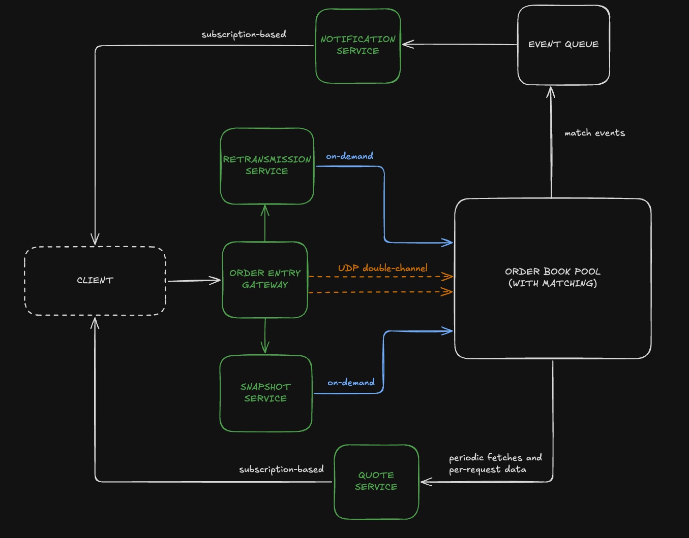

# Stock Exchange Core (C++)

A high-performance, simplified stock exchange core implementation written in C++20. This project demonstrates core concepts of financial trading systems including order matching, market data distribution, and fault tolerance mechanisms.

## Problem Statement

Modern financial exchanges need to process tens of thousands of orders per second with microsecond latency while maintaining data consistency and fault tolerance. This project tackles the fundamental challenges:

- **Order Matching**: Efficiently match buy and sell orders using different algorithms
- **Market Data**: Real-time distribution of quotes and trade notifications
- **Fault Tolerance**: Handle message loss and system recovery
- **Concurrency**: Thread-safe processing of concurrent order flows
- **Protocol Design**: Efficient binary message formats for high-frequency trading

## Architecture Overview



## Project Structure

```
├── src/
│   ├── core/           # Order matching and book management
│   ├── services/       # Exchange services (gateway, quotes, etc.)
│   ├── client/         # Client implementation
│   └── queue/          # Event processing
├── include/            # Header files
├── tests/              # Unit tests
└── Makefile           # Build configuration
```

## Key Features & Design Decisions


1. **Three-Tier Protocol Architecture**: [`ClientProtocol`](include/common/message.h) (24 bytes) carries minimal order data over the network, [`SystemProtocol`](include/common/message.h) (44 bytes) adds sequencing and integrity metadata for internal processing, and [`BatchSystemProtocol`](include/common/message.h) (1000 bytes) aggregates multiple orders for efficient bulk operations and reduced system calls.

2. **Dual-Strategy Price Levels**: The [`PriceLevel`](include/core/price_level.h) class supports both time-priority (FIFO) and size-priority (Pro-Rata) matching within the same data structure, allowing runtime switching between matching algorithms.

3. **Batch Protocol with Zero-Copy Design**: The [`BatchSystemProtocol`](include/common/message.h) uses a fixed 1000-byte array with inline serialization, enabling efficient batching without dynamic allocations in the hot path.

4. **Singleton Services with Thread Safety**: Services like [`RetransmissionService`](include/services/retransmission_service.h) use the singleton pattern with proper mutex protection, ensuring system-wide consistency while avoiding global state issues.

5. **Sequence Number Gap Detection**: The [`OrderBook::process`](src/core/order_book.cpp) method implements intelligent gap detection, automatically requesting retransmissions or snapshots based on sequence number discontinuities.

6. **Event-Driven Architecture**: The [`EventQueue`](include/queue/event_queue.h) decouples order processing from client notifications, allowing for asynchronous trade reporting without blocking the matching engine.

### 🚀 Matching Strategies

The system supports pluggable matching algorithms:

- **FIFO Strategy** ([`FIFOStrategy`](include/core/fifo_strategy.h)): Time-priority matching (first-in-first-out)
- **Pro-Rata Strategy** ([`ProRataStrategy`](include/core/pro_rata_strategy.h)): Size-weighted allocation for large orders

### 🔄 Fault Tolerance

- **Message Retransmission**: Automatic detection and recovery of lost messages
- **Snapshot Recovery**: Point-in-time order book snapshots for fast recovery
- **Checksum Validation**: Built-in message integrity verification

### 📊 Market Data

- **Real-time Quotes**: Live bid/ask prices and market depth via [`QuoteService`](include/services/quote_service.h)
- **Trade Notifications**: Asynchronous client notifications for order status changes
- **Market Depth**: Top-of-book and deep market data aggregation

## Building and Running

### Prerequisites

- C++20 compatible compiler (GCC 10+ or Clang 12+)
- Linux environment

### Build Commands

```bash
# Build the main exchange
make build

# Run the exchange
make run

# Run performance tests
make perf

# Run performance tests
make test

# Clean build artifacts
make clean
```

## Alternative setup using Docker

```bash
docker build -t stock-exchange-core
docker run --rm stock-exchange-core
docker run --rm stock-exchange-core ./bin/unit_tests # to run unit tests
docker run --rm stock-exchange-core ./bin/perf_tests # to run performance tests
```

### Sample Output (of the current main.cpp)

```
Initializing exchange...
Client 1 sending BUY order: 4 at price 98
Client 1 sending SELL order: 33 at price 98
Client 1 sending BUY order: 60 at price 98
Processing final batch of 3 orders before shutdown
TradeNotificationService: Processing event 1
Client 1 received notification: Order 1 (timestamp: 1757532926622733) status: Partially filled and added
TradeNotificationService: Processing event 1
Client 1 received notification: Order 1 (timestamp: 1757532927651177) status: Filled
TradeNotificationService: Processing event 2
Client 1 received notification: Order 2 (timestamp: 1757532926622735) status: Partially filled and added
Exchange shutting down.
```

### Results of performance tests for a single thread:

```
=== Single Thread Throughput ===
Throughput: 403452.21 orders/sec
Total Orders: 10000 orders
Duration: 0.02 seconds
Avg Latency: 2.29 μs
P95 Latency: 0.00 μs
P99 Latency: 55.00 μ
```

## Next Steps

- Multiple instrument support with dynamic order book allocation
- Real-time risk management integration
- Network layer for remote client connectivity
- Monitoring and metrics collection (latency histograms, throughput)
